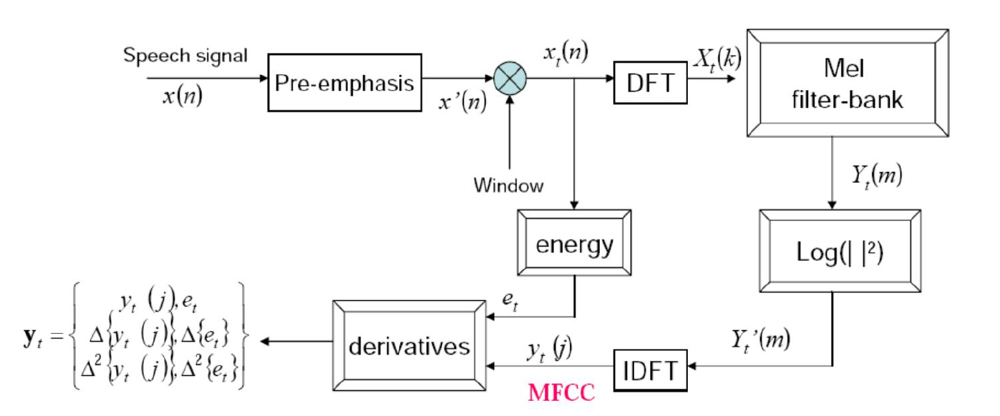
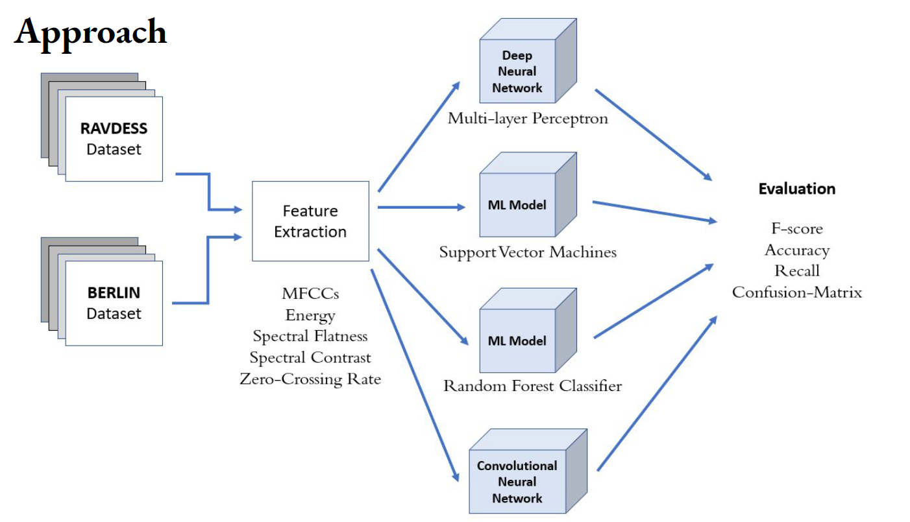
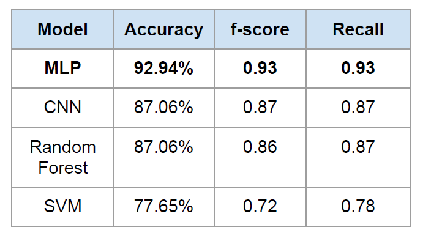
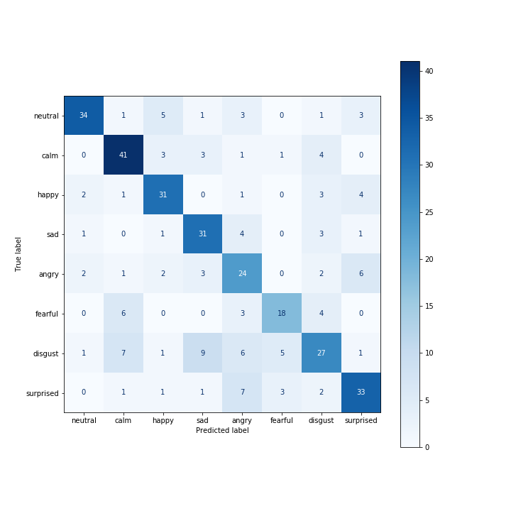
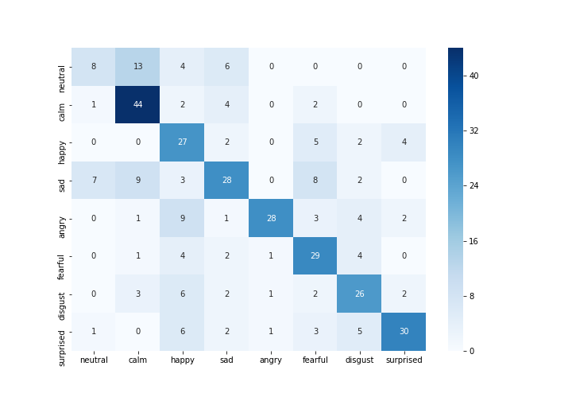
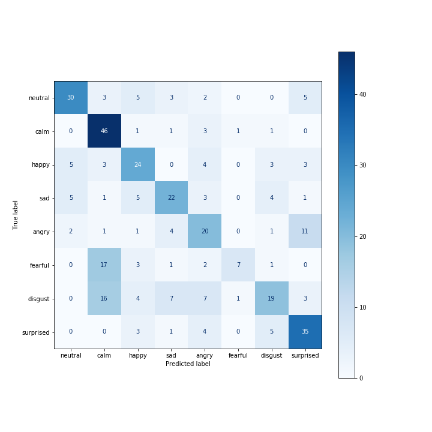
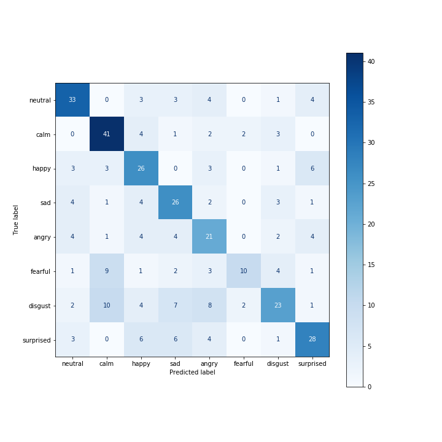
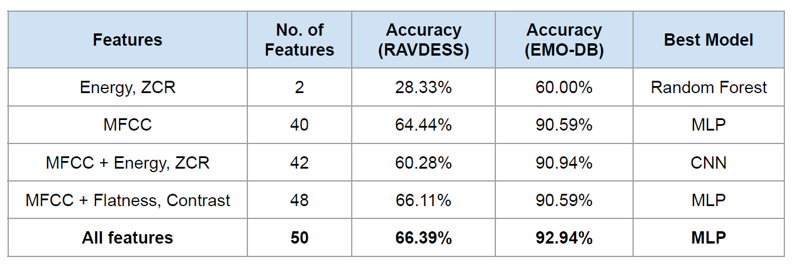

# Speech Emotion Recognition
Communication based on emotions is an important capability. Detecting the emotional state of a speaker from speech aids in extraction of important semantic information. Automatic speech emotion recognition is a challenging task due to the
discontinuity between acoustic features and human emotions.

## Motivation
- To achieve truly effective HCI interaction, there is a need for computers to be able to interact naturally with humans.
- ‘Behavioural Biometrics’ is an upcoming field which deals with utilizing behaviour information like emotions as these traits are impossible to steal.

## Features Used
- Mel-frequency Cepstral Coefficients (MFCCs)
- Spectral Contrast
- Spectral Flatness
- RMS Energy
- Zero-Crossing Rate

## Data Pipeline
Workflow of the project is as follows:

## Results
Accuracy, f-score and Recall values of different models were calculated. 

Multi Layer Perceptron out performed other models due to limited availability of training data.

## Analysis
#### Confusion Matrices
Multilayer Perceptron                                         |   Convolutional Neural Network
:-------------------------:|:-------------------------:
   |             
Random Forest Classifier                                      |   Support Vector Machine
  |    

#### Feature-Based Accuracy Comparison

 

